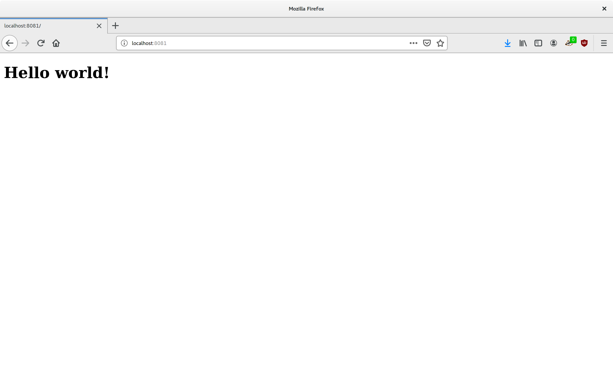

# Een Python HTTP Server
Een kleine server, die wanneer je die draait in de webbrowser kan gebruiken.



## Terminologie
In deze voorbeeld wordt het volgende vakjargon gebruikt:
1. socket\
Methode waarmee je programma kan communiceren met andere programma. 
2. port\
Er kunnen meerdere programma's op een computer draaien, met de port nummer kunnen ze met elkaar communiceren
3. host\
De domein naam of IP van het programma
4. html\
Hypertext Markup Language, de taal waar web apps in gemaakt zijn
5. TCP, Transmission Control Protocol, Het protocol gebruikt onder HTTP

## Flow van het programma
1. Maak een TCP socket aan
2. Bind de socket aan localhost en poort 8081
3. Zet de timeout van de socket op 100ms
4. Accepteer inkomende connectie
5. Print de inkomende string als UTF-8
6. Geef een HTTP connectie terug met wat HTML
7. Sluit de geaccepteerde connectie
8. ga naar stap 4


## Code
```python
#!/usr/bin/env python
# Example webserver based written in Python
# Author Heiko van der Heijden
import socket

# Some Global Variables
PORT = 8081
HOST = 'localhost'
INPUT_BUFFER = 1024

# HTML string we would like to send to the webbrowser
HTML_RESPONSE = "<!DOCTYPE html><html><body><h1>Hello world!</h1></body></html>"
# The HTTP request
HTTP_RESP = "HTTP/1.1 200 OK\r\nServer: PythonWebServer\r\nPragma: no-cache\r\nExpires: 0 \r\nContent-Type: text/html\r\nContent-Length: %i\r\n\r\n%s"

print ("Starting Server")
print("Please go with your browser to http://%s:%i" % (HOST, PORT))

# Open a TCP socket
sock = socket.socket(socket.AF_INET, socket.SOCK_STREAM)
sock.bind((HOST, PORT))
sock.listen(100) # timeout

try:
    print("Press control c to quit")
    while True:
        # Accept a request
        conn, addr = sock.accept()
        print("Connected by ", addr)
        data = conn.recv(INPUT_BUFFER).decode("utf-8")
        # Print the http request from the web browser.
        print(data)
        
        # Create a response based on the HTML and the http headers
        response = HTTP_RESP % (len(HTML_RESPONSE), HTML_RESPONSE)
        
        # Encode it to bytes
        response = response.encode('utf-8')
        conn.sendall(response) 
        
        conn.close()
except KeyboardInterrupt:
    print("Closing program")
except Exception as ex:
    print("Something unexpected has happened")
    print(ex)


sock.close()


```